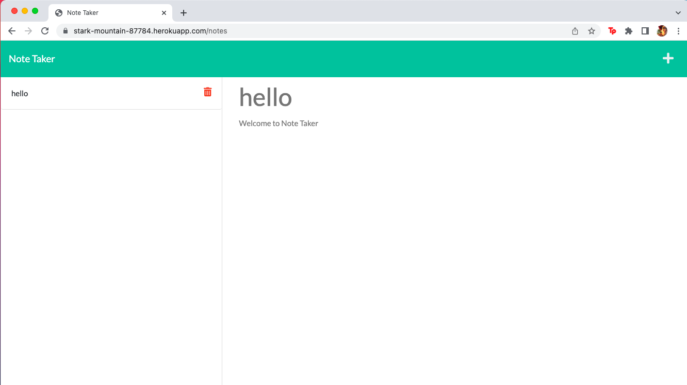

# Note Taker
  

## Description
This application allows the user to write and save notes. This will help any user stay organized, by offering a central place to store thoughts and reminders. This application uses Express.js on the backend where notes are stored in a JSON file. All routes are set up with care to allow the frontend and backend to communicate seamlessy.

## Table of Contents
- [Installation](#installation)
- [Usage](#usage)
- [License](#license)
- [Contributing](#contributing)
- [Tests](#tests)
- [Questions](#questions)
- [Visuals](#visuals)

## Installation

No installation is required.

## Usage

This application is run in the browser, so any user can simply click on the deployed link and begin taking notes.

## License
  
  This project uses the MIT license. 
  **If you have questions on the license please check the following site [choose a license](https://www.google.com)

## Contributing

If you would like to contribute please feel free to reach out by email. 

## Tests

There are currently no tests written for this application.

## Questions

Please feel free to explore my other projects on github: [tracyroseguajardo](https://www.github.com/tracyroseguajardo)

If you have further questions you may send me an email at: tracyroseguajardo@gmail.com

## Visuals

Link to deployed application on Heroku:
[Note Taker](https://stark-mountain-87784.herokuapp.com/)

Screenshot of application:
